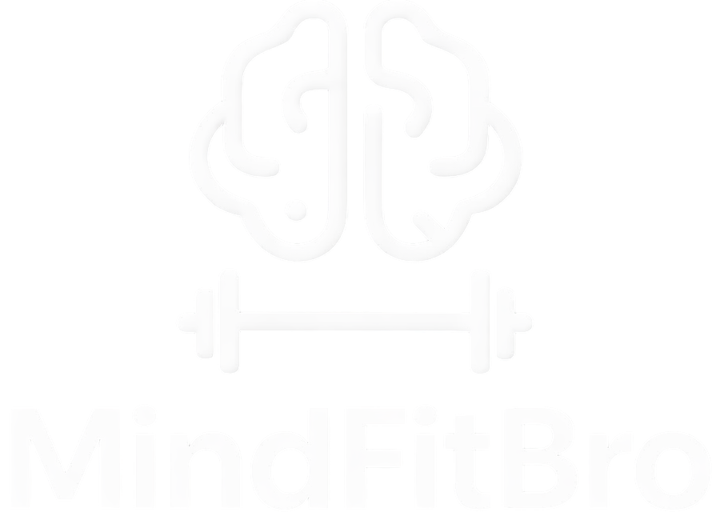

# MindFitBro — Smart Fitness Platform

<p align="center">
  
</p>

<p align="center">
  
  
  
  
  
</p>

---

## Overview

**MindFitBro** is a full-featured fitness and personal training web platform built with Laravel 12. It connects clients with specialized coaches and helps them track their daily progress.

The platform supports **3 distinct roles**:

| Role | Description |
|------|-------------|
| 👤 **User** | Client — purchases a plan, books sessions, tracks progress |
| 🏋️ **Coach** | Manages sessions, monitors subscribers, records evaluations |
| ⚙️ **Admin** | Full platform administration |

---

## Key Features

### For Clients
- **Guest Checkout** — Purchase directly with name and email, no account required upfront
- **Smart Cart** — Add, update, and remove plans with yearly pricing and coupon support
- **Session Booking** — Schedule meetings with a coach directly from the dashboard
- **Progress Tracking** — Monitor weight, attendance, and training program completion
- **Calorie Calculator** — Built-in tool to calculate daily calorie needs

### For Coaches
- **Professional Dashboard** — Full stats: total clients, sessions, and monthly revenue
- **Booking Management** — Accept or reject appointments and add Google Meet links
- **Subscriber Monitoring** — Detailed profile per client with a 90-day attendance heatmap
- **Fitness Evaluations** — Record body composition data (weight, body fat %, muscle mass)
- **Attendance Tracking** — Daily attendance log (present / late / absent)

### General
- **Bilingual Support (AR/EN)** — Full Arabic and English UI
- **Automated Emails** — Purchase confirmation with invoice, password reset
- **Fully Responsive** — Works on all devices (mobile, tablet, desktop)

---

## Tech Stack

### Backend
| Technology | Version | Purpose |
|------------|---------|---------|
| PHP | ^8.2 | Core programming language |
| Laravel | 12.0 | Web framework |
| MySQL | latest | Database |

### Frontend
| Technology | Version | Purpose |
|------------|---------|---------|
| Tailwind CSS | 3.x | UI styling |
| Alpine.js | CDN | Reactivity & interactivity |
| Vite | 7.x | Asset bundling |
| Swiper.js | 11.x | Sliders |
| GSAP | 3.12 | Animations |
| Material Symbols | Google | Icons |
| Cairo Font | Google | Arabic typography |

---

## Requirements

- PHP >= 8.2
- Composer
- Node.js >= 18
- MySQL >= 8.0
- XAMPP / Laragon / any local server

---

## Installation

### 1. Clone the repository
```bash
git clone https://github.com/Eng-AbdallahEmad/mindfitbro.git
cd mindfitbro
```

### 2. Install dependencies
```bash
composer install
npm install
```

### 3. Set up the environment file
```bash
cp .env.example .env
php artisan key:generate
```

### 4. Configure the database
Edit the following in your `.env` file:
```env
DB_CONNECTION=mysql
DB_HOST=127.0.0.1
DB_PORT=3306
DB_DATABASE=mindfitbro_db
DB_USERNAME=root
DB_PASSWORD=
```

### 5. Configure email
```env
MAIL_MAILER=smtp
MAIL_HOST=mail.spacemail.com
MAIL_PORT=465
MAIL_USERNAME=info@mindfitbro.com
MAIL_PASSWORD=your_password_here
MAIL_ENCRYPTION=ssl
MAIL_FROM_ADDRESS=info@mindfitbro.com
MAIL_FROM_NAME="MindFitBro"
```

### 6. Run migrations and seeders
```bash
php artisan migrate --seed
```

### 7. Build assets
```bash
npm run build
# or for development:
npm run dev
```

### 8. Start the server
```bash
php artisan serve
```
Then open your browser at: `http://localhost:8000`

---

## Database Schema

```
users                    ← Users (clients / coaches / admins)
user_profiles            ← Fitness profile (height, weight, date of birth)
plans                    ← Available subscription plans
features                 ← Plan features
feature_plan             ← Pivot: plan-feature relationships
subscriptions            ← User subscriptions (+ guest checkout fields)
carts                    ← Shopping carts
cart_items               ← Cart line items with pricing snapshots
meeting_bookings         ← Coach-client meeting appointments
programs                 ← Training programs
program_days             ← Weekly workout/rest schedule
user_workout_logs        ← Workout completion logs
weight_logs              ← Weight tracking history
attendances              ← Daily attendance records
member_evaluations       ← Coach fitness evaluations
```

---

## Available Plans

| Plan | Name | Monthly Price | Yearly Discount | Most Popular |
|------|------|--------------|----------------|-------------|
| 🥉 Starter | الأساسي | 299 SAR | 10% | — |
| 🥇 Pro | النخبة | 599 SAR | 15% | ✅ |
| 💎 Elite | إيليت | 999 SAR | 20% | — |

### Discount Coupons (10% off)
```
MFB10 · MINDFITBRO · WELCOME · EID2025
```

---

## Project Structure

```
app/
├── Http/
│   ├── Controllers/
│   │   ├── Auth/AuthController.php          ← Register, login, password reset
│   │   └── Web/
│   │       ├── HomeController.php           ← Home page
│   │       ├── CartController.php           ← Cart management (AJAX)
│   │       ├── CheckoutController.php       ← Checkout & guest checkout
│   │       ├── DashboardController.php      ← Client & coach dashboard
│   │       ├── BookingController.php        ← Session booking
│   │       └── SubscriberController.php     ← Subscriber monitoring
│   └── Middleware/
├── Mail/
│   └── PurchaseConfirmationMail.php         ← Purchase confirmation email
├── Models/
│   ├── User.php · Subscription.php · Plan.php
│   ├── Cart.php · CartItem.php · Feature.php
│   ├── MeetingBooking.php · Program.php
│   ├── Attendance.php · MemberEvaluation.php
│   └── WeightLog.php · UserWorkoutLog.php
├── Notifications/
│   └── ResetPasswordNotification.php        ← Password reset notification
└── Services/Web/
    ├── HomeService.php                      ← Home page data
    ├── CartService.php                      ← Cart & pricing logic
    ├── CheckoutService.php                  ← Checkout logic
    ├── DashboardService.php                 ← Client dashboard data
    └── CoachDashboardService.php            ← Coach dashboard data

resources/
├── views/
│   ├── layouts/web/app.blade.php           ← Main layout
│   ├── components/web/                     ← navbar, sidebar, footer, ...
│   ├── auth/web/                           ← login, register, complete_account, ...
│   ├── app/web/                            ← home, cart, dashboard, bookings, ...
│   └── mail/                              ← Email templates
├── lang/
│   ├── ar/messages.php                     ← Arabic translations
│   └── en/messages.php                     ← English translations
└── css/ · js/

database/
├── migrations/                             ← 24+ migration files
└── seeders/
    ├── PlanSeeder.php                      ← 3 plans + 9 features
    └── CoachSeeder.php                     ← Demo coach account
```

---

## Core Workflows

### 1. Regular Client Journey
```
Register → Choose Plan → Cart → Checkout → Book Session → Track Progress
```

### 2. Guest Checkout Flow
```
Choose Plan → Cart → Checkout with name & email
    → Confirmation email with invoice
    → Complete account link
    → Create account & link to subscription
    → Book first session
```

### 3. Coach Workflow
```
Receive booking requests → Accept/Reject + Add Meet link
    → Log daily attendance
    → Record periodic evaluations
    → Monitor each client's progress
```

---

## Main Routes

| Path | Method | Function |
|------|--------|----------|
| `/` | GET | Home page |
| `/auth/register` | GET/POST | Create new account |
| `/auth/login` | GET/POST | Sign in |
| `/auth/forgot-password` | GET/POST | Password recovery |
| `/cart` | GET | View cart |
| `/cart/add` | POST | Add plan to cart |
| `/cart/apply-coupon` | POST | Apply discount coupon |
| `/checkout` | POST | Process purchase |
| `/checkout/success/{id}` | GET | Purchase success page |
| `/complete-account/{token}` | GET/POST | Complete guest account |
| `/dashboard` | GET | Dashboard (client or coach) |
| `/schedule-meeting/{subscription}` | GET | Book a session |
| `/coach/bookings` | GET | Coach bookings list |
| `/coach/subscribers` | GET | Coach subscribers list |
| `/coach/subscribers/{id}` | GET | Subscriber detail profile |
| `/calorie-calculator` | GET | Calorie calculator tool |

---

## Key Environment Variables

```env
APP_NAME=MindFitBro
APP_ENV=local
APP_URL=http://localhost

DB_DATABASE=mindfitbro_db

MAIL_MAILER=smtp
MAIL_HOST=mail.spacemail.com
MAIL_PORT=465
MAIL_ENCRYPTION=ssl
MAIL_USERNAME=info@mindfitbro.com
MAIL_PASSWORD=          ← Required

SESSION_DRIVER=database
CACHE_STORE=database
QUEUE_CONNECTION=database
```

---

## Roadmap

- [ ] Full admin control panel
- [ ] Online payment gateway (Stripe / Moyasar)
- [ ] Advanced reports and analytics

---

## Developer

**Abdallah Emad**
- GitHub: [@Eng-AbdallahEmad](https://github.com/Eng-AbdallahEmad)

---

<p align="center">
  Built with ❤️ to help people become the best version of themselves
</p>
